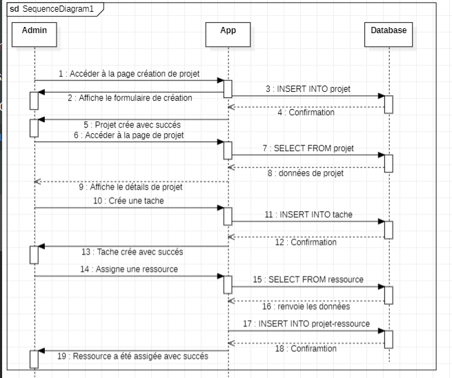

# **ConstructionXpert Services - Application de Gestion de Projets de Construction**

**Description**
ConstructionXpert Services Solution est une application de gestion de projets basée sur le web, spécialement conçue pour les équipes de construction. Développée en tant que solution full-stack, elle permet aux administrateurs de créer, gérer et suivre efficacement les projets de construction, d'assigner des tâches aux membres de l'équipe et de superviser l'allocation des ressources. Grâce à une interface conviviale, l'application permet de visualiser, mettre à jour et supprimer des projets, des tâches et des ressources, assurant ainsi une planification et une organisation optimisées des flux de travail de construction.

**Fonctionnalités principales**

### Gestion des projets : Créer, visualiser, mettre à jour et supprimer des projets de construction, avec des détails tels que le nom, la description, les dates de début/fin et le budget.

### Gestion des tâches : Assigner et gérer des tâches au sein des projets, en précisant les descriptions, les délais et les ressources nécessaires.

### Gestion des ressources : Ajouter, mettre à jour et suivre les ressources (par exemple, nom, type, quantité, informations sur le fournisseur), avec ajustement automatique des quantités après l'assignation des tâches.

### Technologies utilisées

**Backend :** Java, Java EE (Servlets, JSP), JDBC, Apache Tomcat

**Base de données** : MySQL

**Frontend** : HTML, CSS , JavaScript

Outils : Git (contrôle de version), Figma (maquettes)

